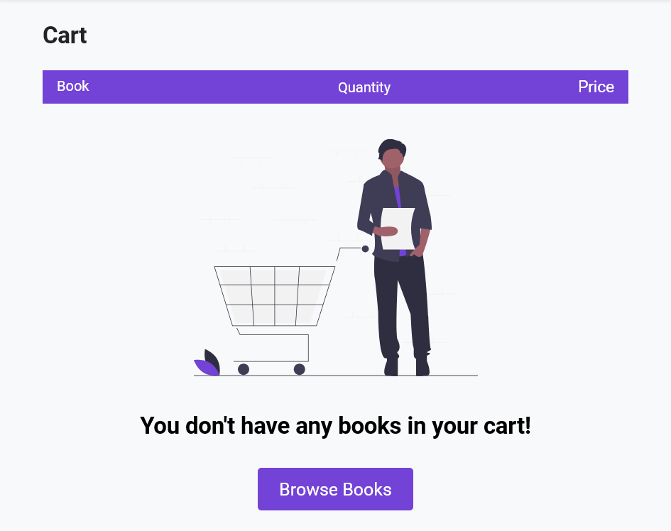
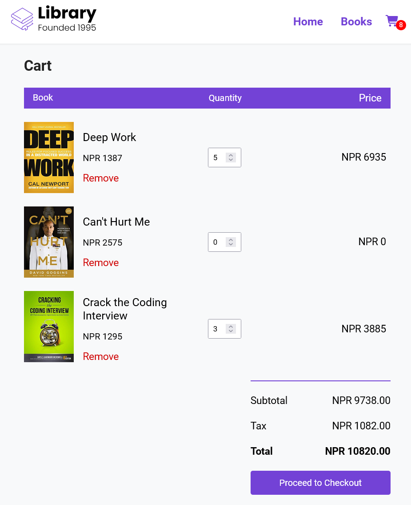

# 📚 Library - Online Book Store

A modern, fully-responsive React e-commerce application for browsing and purchasing books online. Features a clean UI, skeleton loading states, dynamic cart management, and smooth routing with React Router.


##  Features

- **📖 Book Browsing**: Browse through a curated collection of books with ratings, prices, and sale information
- **🔍 Filtering**: Filter books by rating and price
- **🛒 Shopping Cart**: Full cart functionality with quantity management
- **💰 Dynamic Pricing**: Real-time price calculations with tax and subtotal
- **⭐ Star Ratings**: Visual star ratings with support for half-stars
- **🎨 Skeleton Loading**: Smooth loading states for better UX
- **📱 Responsive Design**: Fully responsive across all devices
- **🚀 Fast Navigation**: Client-side routing with React Router for instant page transitions


##  Technologies Used

- **React 19.2** - UI library
- **React Router v6** - Client-side routing
- **Font Awesome** - Icons
- **CSS3 with BEM** - Styling and animations using BEM (Block Element Modifier) methodology
- **JavaScript ES6+** - Modern JavaScript features






##  Installation

1. Clone the repository:
```bash
git clone https://github.com/yourusername/library-react-project.git
cd library-react-project
```

2. Install dependencies:
```bash
npm install
```

3. Start the development server:
```bash
npm start
```

4. Open [http://localhost:3000](http://localhost:3000) to view it in your browser.

##  Project Structure

```
library-react-project/
├── public/
│   ├── index.html
│   └── manifest.json
├── src/
│   ├── components/
│   │   ├── Nav.jsx              # Navigation bar
│   │   ├── Footer.jsx           # Footer component
│   │   ├── Landing.jsx          # Hero section
│   │   ├── Highlights.jsx       # Features section
│   │   ├── Featured.jsx         # Featured books
│   │   ├── Discounted.jsx       # Discounted books
│   │   ├── Explore.jsx          # CTA section
│   │   └── UI/
│   │       ├── Book.jsx         # Book card with skeleton loading
│   │       ├── Rating.jsx       # Star rating component
│   │       ├── Price.jsx        # Price display component
│   │       └── Highlight.jsx    # Feature highlight card
│   ├── pages/
│   │   ├── Home.jsx             # Home page
│   │   ├── Books.jsx            # Books listing page
│   │   ├── BookDetails.jsx      # Individual book details
│   │   └── Cart.jsx             # Shopping cart page
│   ├── assets/                  # Images and SVGs
│   ├── App.jsx                  # Main app component
│   ├── data.js                  # Mock book data
│   ├── index.js                 # Entry point
│   └── index.css                # Global styles
└── package.json
```

##  Key Features 

### Cart Management
- Add books to cart with quantity tracking
- Update quantities directly from cart
- Remove items from cart
- Automatic price calculations (subtotal, tax, total)
- Persistent cart state across navigation

### Image Loading
- Skeleton screens while images load
- Smooth transitions from skeleton to loaded images
- Optimized loading with `onload` detection

### Routing
- `/` - Home page with featured and discounted books
- `/books` - Full books catalog with filtering
- `/books/:title` - Individual book details
- `/cart` - Shopping cart

### State Management
- Lifted state pattern for cart management
- Props drilling for component communication
- Functional state updates to avoid stale state bugs

##  Available Scripts

- `npm start` - Run the app in development mode
- `npm run build` - Build the app for production
- `npm test` - Run tests
- `npm run eject` - Eject from Create React App (one-way operation)

## 💡 What I Learned

This project helped me understand:
- **React state management**: Lifting state, functional updates, and avoiding mutations
- **Declarative vs imperative patterns**: Using `.map()` to transform entire arrays instead of imperative loops
- **useEffect dependencies**: Proper dependency management to avoid infinite loops
- **Image loading optimization**: Using skeleton screens and load detection
- **Component composition**: Breaking UI into reusable components
- **React Router**: Client-side routing and navigation

##  Design 

- Clean, modern UI with purple accent color
- Skeleton loading states for smooth UX
- Responsive layout
- Hover effects and transitions

## 📝 Future Enhancements

- [ ] Backend integration with real API
- [ ] User authentication
- [ ] Search functionality
- [ ] Wishlist feature
- [ ] Order history
- [ ] Book reviews and comments
- [ ] Pagination for books list
- [ ] LocalStorage for cart persistence


## 👤 Author

**Binit Acharya**
- GitHub: [BinitAcharya7](https://github.com/BinitAcharya7)

## 🙏 Acknowledgments

- Built with Create React App
- Icons from Font Awesome
- Inspired by modern e-commerce platforms

---

